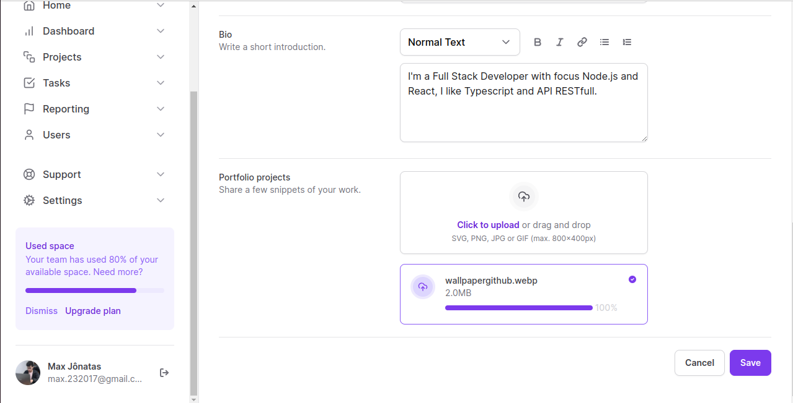

### Projeto Tailwind - Curso Tailwind Rocketseat - 2023
### ***Tailwind CSS***
#### Sobre o projeto:
 * Site one page utilizando Tailwind CSS com Next.js(v.14), aplicando conceitos de pattern de componentização e Atomic Design, responsividade e modo Dark com base na configuração do sistema do usuário.

### Screenshots do projeto





### Principais tecnologias usadas no desenvolvimento:

* TypeScript
* Next.js(v.14x)
* Tailwind CSS

### Bibliotecas em destaque:

* Tailwind CSS
* Tailwind Variants
* Radix UI

### Etapa do desenvolvimento:

* Finalizado
### Passo-a-passo para rodar a aplicação:

1. Entre na pasta Ignite-Tailwind;
2. use o comando: ***yarn*** ou ***npm install/i*** para instalar os pacotes;
3. use o comando:

```bash
npm run dev
# or
yarn dev
# or
pnpm dev